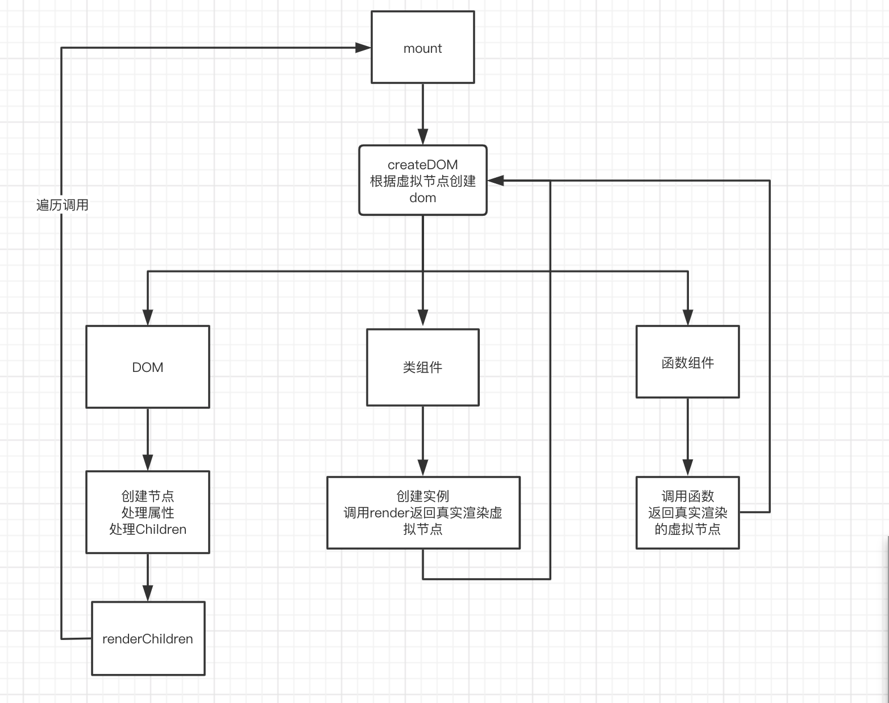
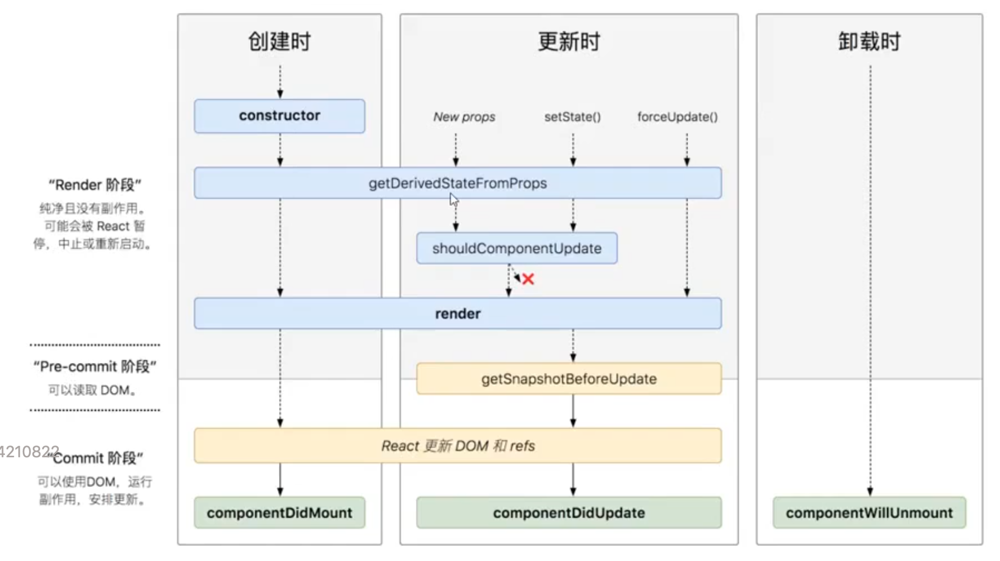

# custom-react

## 渲染


## 事件
- 将事件挂载到document
- 通过事件的target
  - 找到真正触发事件的DOM元素
  - 找到事件方法
- 找到DOM元素身上存储store。找到事件处理函数
- 通过递归target.parentNode实现事件冒泡
- 合成事件
  - 浏览器的原生事件的跨浏览器包装器
  - 提供浏览器原生事件相同接口

## setState

### 模式
- 批量更新模式
  - 在react事件处理方法，钩子函数等都是采用批量更新模式
  - 会把多次更新合并成一次处理。
- 非批量更新模式
  - 例如开启定时器等会破坏批量更新模式

### 批量更新例子

```js
export default class Click extends React.PureComponent {
  state = {
    count: 1
  }
  click = () => {
    console.log('1-', this.state.count)
    this.setState({
      count: this.state.count + 1
    }, () => {
      console.log('callback 1', this.state.count)
    })
    console.log('2-', this.state.count)
    this.setState({
      count: this.state.count + 1
    }, () => {
      console.log('callback 2', this.state.count)
    })
    console.log('3-', this.state.count)
  }
  render() {
    const { count } = this.state
    console.log('render')
    return (
      <>
        <p>{count}</p>
        <button onClick={this.click}>按钮</button>
      </>
    )
  }
}
```

**输出**

```
1- 1
2- 1
3- 1
render
callback 1 2
callback 2 2
```

### 没批量更新模式

```js
export default class Click extends React.PureComponent {
  state = {
    count: 1
  }
  click = () => {
    for (let i = 0;i < 5;i += 1) {
      setTimeout(() => {
        console.log('before', this.state.count)
        this.setState({
          count: this.state.count + 1
        }, () => {
          console.log('callback1', this.state.count)
        })
        console.log('after', this.state.count)
      }, 1000);
    }
  }
  render() {
    const { count } = this.state
    console.log('render')
    return (
      <>
        <p>{count}</p>
        <button onClick={this.click}>按钮</button>
      </>
    )
  }
}
```

**输出**

```
before 1
render
callback1 2
after 2
before 2
render
callback1 3
after 3
before 3
render
callback1 4
after 4
before 4
render
callback1 5
after 5
before 5
render
callback1 6
after 6
```

### 设置相同值

> 设置跟当前state相同的值，不会进行render刷新

```js
// 点击后输出1 1。没有走render和componentDidUpdate
export default class Click extends React.PureComponent {
  state = {
    count: 1
  }
  click = () => {
    console.log(this.state.count)
    this.setState({
      count: 1
    })
    console.log(this.state.count)
  }
  componentDidUpdate() {
    console.log('componentDidUpdate')
  }
  render() {
    const { count } = this.state
    console.log('render')
    return (
      <>
        <p>{count}</p>
        <button onClick={this.click}>按钮</button>
      </>
    )
  }
}
```

## useState设置不同值

- 第一次设置为2，会重新render
- 第二次设置为2，还是会执行render
- 第三次及后续就不会调用render

```js
export default function Click() {
  const [count, setCount] = React.useState(1)
  console.log('render')
  return (
    <>
      <p>{count}</p>
      <button onClick={() => {
        setCount(2)
      }}>按钮</button>
    </>
  )
}
```

## 类组件的生命周期(react17)



### 挂载mount
- constructor
- static getDerivedStateFromProps(nextProps,prevState)
- render
- componentDidMount

### props或state更新
- static getDerivedStateFromProps(nextProps,prevState)
- shouldComponentUpdate()
  - false: 结束
  - true：
    - render
    - getSnapshotBeforeUpdate(prevProps, prevState)
    - componentDidUpdate(prevProps, prevState, snapshot): snapshot是getSnapshotBeforeUpdate的返回值

### forceUpdate
- static getDerivedStateFromProps(nextProps,prevState)
- render
- getSnapshotBeforeUpdate(prevProps, prevState)
- componentDidUpdate(prevProps, prevState, snapshot): snapshot是getSnapshotBeforeUpdate的返回值

### 卸载
- componentWillUnmount

## 父子关系生命周期

- 挂载
  - (父)constructor
  - (父)static getDerivedStateFromProps(nextProps,prevState)
  - (父)render

  - (子)constructor
  - (子)static getDerivedStateFromProps(nextProps,prevState)
  - (子)render
  - (子)componentDidMount

  - (父)componentDidMount

## Context

- 消费：
  - 类组件
    - static contextType
    - Consumer
  - 函数组件：
    - Consumer

```jsx
const MyContext = React.createContext()

// 提供
<MyContext.Provider value={{...context}}>
  {...other}
</MyContext.Provider>  

// 消费：类组件
class Eye extends CustomReact.Component {
  static contextType = MyContext
  render(){
    console.log(this.context)
  }
}
// 消费: 函数组件
<MyContext.Consumer>
  {(props)=><Sub {...props}/>}
</MyContext.Consumer>
```

**实现**

```js
export function createContext(initialValue) {
  Provider._value = initialValue;
  function Provider(props) {
    if (!Provider._value) {
      Provider._value = {};
    }

    // 让对象指向不变
    Provider._value = Object.assign(Provider._value, props.value);
    return props.children;
  }

  function Consumer(props) {
    return props.children(Provider._value);
  }

  return {
    Consumer,
    Provider,
  };
}

// 在类组件渲染时，查看其类上是否有contextType静态属性。有则为其实例增加context，指向Provider._value
// render下mountClassComponent
if (Type.contextType) {
  instance.context = Type.contextType.Provider._value;
}
// 更新时由于其引用地址没变，则不需要做处理
```

## PureComponent

> 在Comoponent的基础上扩展shouldComponentUpdate。进行浅层比较。相同就返回false(不更新)，不同则返回true(更新)

```js
export class PureComponent extends Component {
  shouldComponentUpdate(nextProps, nextState) {
   return !shallowEqual(this.props, nextProps) || !shallowEqual(this.state, nextState);
  }
}

function shallowEqual(obj1, obj2) {
  if (obj1 === obj2) {
    return true;
  }

  if (typeof obj1 !== 'object' || obj1 === null || typeof obj2 !== 'object' || obj2 === null) {
    return false;
  }

  const keys1 = Object.keys(obj1);
  const keys2 = Object.keys(obj2);

  if (keys1.length !== keys2.length) {
    return false;
  }

  for (const key in obj1) {
    if (key === 'children') {
      continue;
    }

    if (obj2[key] !== obj1[key]) {
      return false;
    }
  }
  return true;
}
```

## React.memo

> 针对函数组件的shouldComponentUpdate

```js
function Sub({ count }) {
  return (
    <div>
      <button>按钮{props.count}</button>
    </div>
  )
}

// 调用React.memo返回一个新的组件。
// 只有在props更新的情况下才会更新
const SubMemo = React.memo(Sub)
```

**实现**

> 主要去实现类组件的shouldComponentUpdate

```ts
export function memo(FunctionComponent, compare?: (prevProps, nextProps) => boolean) {
  if (compare) {
    return class extends Component {
      shouldComponentUpdate(nextProps) {
        return compare(this.props, nextProps);
      }
      render() {
        return FunctionComponent(this.props);
      }
    };
  }

  return class extends PureComponent {
    render() {
      return FunctionComponent(this.props);
    }
  };
}
```

## hook
> 它可以让你在不编写 class 的情况下使用 state 以及其他的 React 特性。

### 规则
- 只在最顶层使用 Hook。不能在循环，条件或者嵌套函数中使用hook
- 只能在react函数中使用
  - react函数组件
  - 自定义hook中调用其他hook

### 原理
- 会维护为一个对应的数组`hookState`
- 一个索引`hookIndex`
- 会根据索引去 初始化或获取之前的值

```js
const hookState = [];
let hookIndex = 0;
```

## useReducer

- 根据不同type进行处理

### 使用

```js
import React from 'react'

const ADD = 'ADD'
const DESC = 'DESC'
function reducer(state, action) {
  switch (action.type) {
    case ADD:
      return { number: state.number + (action.payload || 1) }
    case DESC:
      return { number: state.number - 1 }
    default:
      return state
  }
}

export default function App() {
  const [state, dispatch] = React.useReducer(reducer, { number: 1 })

  return (
    <div >
      <div>{state.number}</div>
      <button onClick={() => {
        dispatch({
          type: ADD,
          payload: 2
        })
      }}>+2</button>
      <button onClick={() => {
        dispatch({
          type: DESC
        })
      }}>-1</button>
    </div>
  )
}
```

### 实现

```ts
type ReducerAction = {
  type: string;
  [x: string]: unknown;
};

type ReaducerActionSetState<T> = (state: T) => T;
type Reducer<T> = (state: T, action: ReducerAction | ReaducerActionSetState<T>) => T | null;

export function useReducer<T>(reducer: Reducer<T>, initalState: T) {
  hookState[hookIndex] = hookState[hookIndex] || (typeof initalState === 'function' ? initalState() : initalState);

  const currentIndex = hookIndex;
  function dispatch(action: ReducerAction) {
    let nextState;
    const lastState = hookState[currentIndex];

    if (reducer) {
      // 处理传递reducer的情况
      nextState = reducer(
        lastState,
        action
      );
    } else {
      // 处理reducer为null的情况
      nextState = typeof action === 'function' ? (action as ReaducerActionSetState<T>)(lastState) : action;
    }

    hookState[currentIndex] = nextState;

    // 更新组件
    fullUpdate();
  }

  return [
    hookState[hookIndex++],
    dispatch
  ];
}
```

## useState

**使用**
```jsx
import React from 'react'
export default function App() {
  const [number, setNumber] = React.useState(0)

  return (
    <div>
      <p>{number}</p>
      <button onClick={() => {
        setNumber(number + 1)
      }}>按钮</button>
    </div>
  )
}
```


**实现**

```ts
export function useState(initalState) {
  return useReducer(null, initalState);
}
```

## React.useMemo

> 把“创建”函数和依赖项数组作为参数传入 useMemo，它仅会在某个依赖项改变时才重新计算 memoized 值。这种优化有助于避免在每次渲染时都进行高开销的计算。
> 缓存值。类似vue的computed

**使用**

```js
const data = React.useMemo(() => ({ number }), [number])
```

**实现**

```ts
// hookIndex++ 主要在进入下一个hook函数能获取正确的索引
// 如果没有传deps。每次都会走重新计算的流程
export function useMemo<T>(factory: () => T, deps?: unknown[]): T {
  // 初始化
  if (!hookState[hookIndex]) {
    const newMemo = factory();
    hookState[hookIndex++] = [newMemo, deps];
    return newMemo;
  }

  const [lastMemo, lastDeps] = hookState[hookIndex];
  const same = deps?.every((item, index) => item === lastDeps?.[index]);
  if (same) {
    // 如果依赖项一样，直接返回缓存的值
    hookIndex += 1;
    return lastMemo;
  }

  // 不同则重新计算
  const memoValue = factory();
  hookState[hookIndex++] = [memoValue, deps];
  return memoValue;
}
```

## useCallback

```js
const handleClick = CustomReact.useCallback(() => {
  // ...do some thing
}, [number])
```

**实现**

```ts
export function useCallback(callback: () => void, deps?: unknown[]) {
  // 初始化
  if (!hookState[hookIndex]) {
    hookState[hookIndex++] = [callback, deps];
    return callback;
  }

  // 判断依赖项是否一样
  const [lastCallback, lastDeps] = hookState[hookIndex];
  const same = deps?.every((item, index) => item === lastDeps?.[index]);
  if (same) {
    // 一样则返回缓存的callback
    hookIndex += 1;
    return lastCallback;
  }

  // 重新缓存新的callback
  hookState[hookIndex++] = [callback, deps];
  return callback;
}
```

## React.useContext

```js
const context = React.useContext(CounterContext)
```

**实现**

```ts
// 跟React.createContext的实现原理对应
export function useContext(Context: { Provider: { _value: unknown; }; }) {
  return Context.Provider._value;
}
```

## React.useEffect

-  useEffect Hook 看做 componentDidMount，componentDidUpdate 和 componentWillUnmount 这三个函数的组合。

```js
function App() {
  const [count, setCount] = React.useState(0)
  
  React.useEffect(() => {
    console.log('use Effect')
    const timer = setInterval(() => {
      setCount(count => count + 1)
    }, 1000)
    return () => {
      clearInterval(timer)
    }
  })

  return <div>{count}</div>
}
```

### componentDidMount

```js
React.useEffect(() => {
  // componentDidMount
},[])
```

### componentDidUpdate

```js
React.useEffect(() => {
  // componentDidUpdate
})
```

### componentWillUnmount
```js
React.useEffect(() => {
  return ()=>{
    // componentWillUnmount
  }
},[])
```

### 实现

```js
// 使用宏任务。浏览器ui渲染后才执行
type DestyoryFn = () => void;
export function useEffect(cb: () => DestyoryFn, deps?: unknown[]) {
  const currentHook = hookIndex;
  if (!hookState[currentHook]) {
    // 初始化
    // 在宏任务中执行
    setTimeout(() => {
      // 先执行一次
      const destoryFunction = cb();
      hookState[currentHook] = [destoryFunction, deps];
    });
    hookIndex += 1;
    return;
  }

  const [destoryFunction, lastDeps] = hookState[currentHook];
  const same = deps?.every((item, index) => item === lastDeps?.[index]);
  //  如果依赖项一样，则不需要执行effect
  if (same) {
    hookIndex++;
    return;
  }

  // 调用销毁函数
  destoryFunction?.();
  // 重新执行
  setTimeout(() => {
    const destoryFunction = cb();
    hookState[currentHook] = [destoryFunction, deps];
  });
  hookIndex += 1;
}
```

## React.useLayoutEffect

**使用**

```js
function App() {
  const ref = React.useRef(null)
  
  // 会有动画效果
  // 因为useEffect是在宏任务才执行。也就是说浏览器ui渲染`之后`才执行
  React.useEffect(() => {
    ref.current.style.transform = 'translate(500px)'
    ref.current.style.transition = '500ms'
  }, [])

  // 不会有动画效果
  // 因为useLayoutEffect是在微任务才执行。也就是说浏览器ui渲染`之前`才执行
  React.useLayoutEffect(() => {
    ref.current.style.transform = 'translate(500px)'
    ref.current.style.transition = '500ms'
  }, [])

  const style = {
    width: '100px',
    height: '100px',
    backgroundColor: 'red'
  }
  return (
    <div style={style} ref={ref}></div>
  )
}
```

**实现**

> 跟useEffect的区别就是queueMicrotask

```ts
// 微任务。在浏览器ui渲染之前执行: queueMicrotask
export function useLayoutEffect(cb: () => DestyoryFn, deps: unknown[]) {
  const currentHookIndex = hookIndex;
  // 初始化
  if (!hookState[currentHookIndex]) {
    queueMicrotask(() => {
      const destoryFunction = cb();
      hookState[currentHookIndex] = [destoryFunction, deps];
    });
    hookIndex += 1;
    return;
  }

  const [destoryFunction, lastDeps] = hookState[currentHookIndex];
  const same = deps?.every((item, index) => item === lastDeps?.[index]);
  if (same) {
    hookIndex++;
    return;
  }

  // 重新执行。先调用销毁函数。在微任务重新执行
  destoryFunction?.();
  queueMicrotask(() => {
    const destoryFunction = cb();
    hookState[currentHookIndex] = [destoryFunction, deps];
  });
  hookIndex += 1;
}
```


## React.forwardRef

> 像外部组件想获取函数组件的ref
> 但是有安全性问题。给到父组件的ref完全暴露。

```js
import React from 'react'

function Sub(props, ref) {
  return <input ref={ref} />
}

const ForwardedSub = React.forwardRef(Sub)

export default function App() {
  const childRef = React.useRef()

  return (
    <div>
      <ForwardedSub ref={childRef} />
      <button onClick={() => {
        childRef.current.focus()
        // 直接可以干掉子级
        // childRef.current.remove()
      }}>获得焦点</button>
    </div>
  )
}
```

**实现**

```ts
import { Component } from 'React';

export function forwardRef(FunctionComponent) {
  return class extends Component {
    render() {
      if (FunctionComponent.length < 2) {
        // 提示
      }
      return FunctionComponent(this.props, this.ref);
    }
  };
}

// 在类组件
if (reactNode.ref) {
  reactNode.ref.current = instance;
  instance.ref = reactNode.ref;
}
```

## React.useImperativeHandle

```js
import React from 'react'

// ref会作为函数组件第二个参数
function Sub(props, ref) {
  const inputRef = React.useRef()
  
  React.useImperativeHandle(ref, () => ({
    // 返回选择暴露给调用组件的方法/属性
    focus() {
      inputRef.current.focus()
    }
  }))

  return <input ref={inputRef} />
}

const ForwardedSub = React.forwardRef(Sub)

export default function App() {
  const childRef = React.useRef()

  return (
    <div>
      <ForwardedSub ref={childRef} />
      <button onClick={() => {
        childRef.current.focus()
        // 报错
        childRef.current.remove()
      }}>获得焦点</button>
    </div>
  )
}
```

**实现**

```ts
// useImperativeHandle 可以让你在使用 ref 时自定义暴露给父组件的实例值
export function useImperativeHandle(ref, factoy) {
  ref.current = factoy();
}
```

## React.useRef

**使用**

```js
const childRef = React.useRef()
```

**实现**

```ts
export function useRef(initialState?: unknown) {
  hookState[hookIndex] = hookState[hookIndex] || { current: initialState };
  return hookState[hookIndex++];
}
```

## hook获取不到最新的值

- 函数组件其实是一个闭包。
- 获取不到最新的值。只能获取当时闭包的值

```js
import React from 'react'
export default function App() {
  const [count, setCount] = React.useState(0)

  function handler() {
    for (let i = 0;i < 3;i += 1) {
      setTimeout(() => {
        // 由于函数组件都是一个闭包。
        // 获取不到最新的值，只能获取到“当时”的值
        console.log(count)  // 0
        setCount(count + 1)
      }, 3000);
    }
  }

  // 页面最后显示的是1
  return (
    <div>
      <p>{count}</p>
      <button onClick={handler}>+</button>
    </div>
  )
}
```

# redux
- store 仓库
- state 状态
- reducer 处理器
- dispatch 派发
- action 动作
- subscribe 订阅


